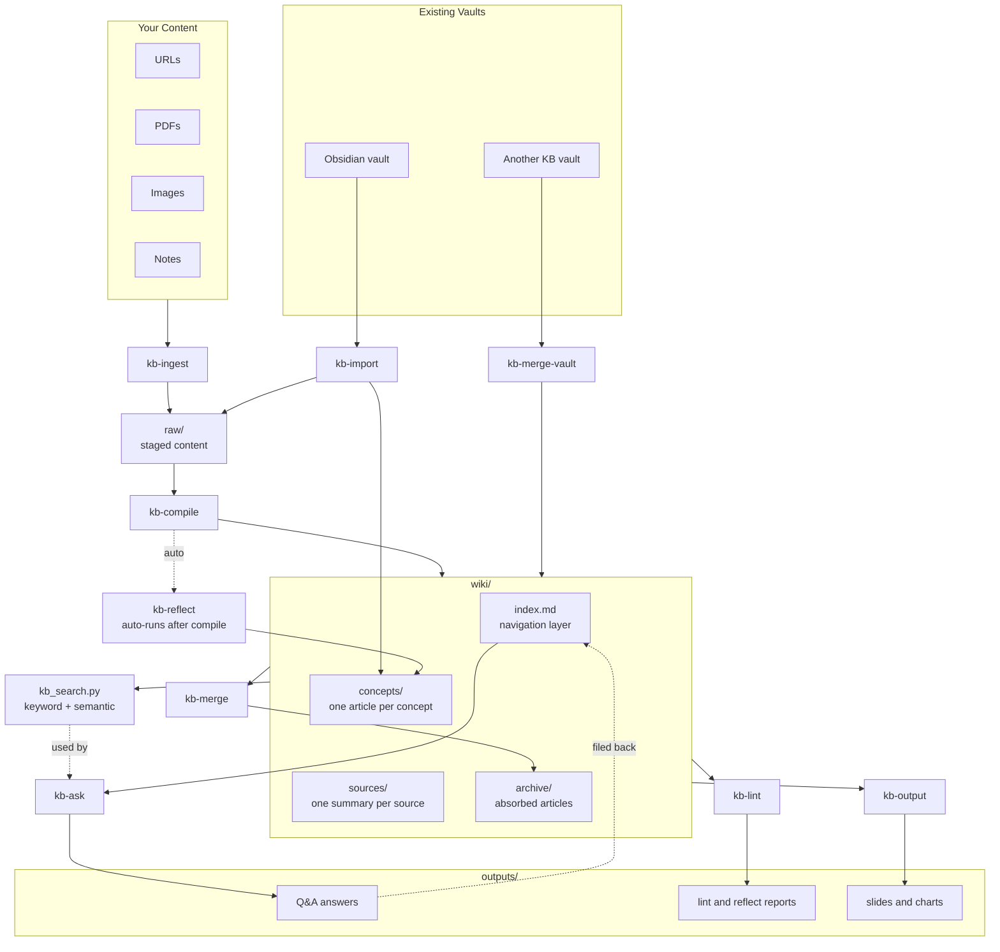

# LLM Knowledge Base for Codex

A self-managed personal knowledge base for Codex. You feed it raw content such as URLs, PDFs, images, and notes; the LLM organizes that material into a wiki-like Obsidian vault by summarizing sources, creating concept pages, linking ideas, and answering questions. You own `raw/`. The agent owns `wiki/` and `outputs/`.

Uses **Obsidian** as the viewer and frontend.

---

## How It Works



---

## Codex Compatibility

This fork is packaged for Codex instead of Claude Code.

- Repo-local skills live in [`.agents/skills`](/Users/yulin/Desktop/obsidian_folder/llm-knowledge-base-codex/.agents/skills).
- `setup.sh` installs them into `~/.codex/skills/`.
- Runtime config is stored at `~/.codex/kb-config.json`.
- Skill names are `kb-ingest`, `kb-compile`, `kb-ask`, and so on.

To invoke a skill in Codex, mention it by name in your request, for example:

```text
Use kb-ingest on https://arxiv.org/abs/1706.03762
Use $kb-compile
Use kb-ask: what is the attention mechanism?
```

---

## Prerequisites

| Requirement | Notes |
|---|---|
| Codex | Required to use the skills |
| [Obsidian](https://obsidian.md) | Used as the vault viewer |
| Python 3.8+ | Required for `kb_search.py` |
| Git | Required because the KB directory is a git repo |

Optional Python packages:

```bash
pip install -r requirements.txt
```

---

## Quickstart

```bash
# 1. Clone your fork
git clone <your-fork-url> llm-knowledge-base-codex
cd llm-knowledge-base-codex

# 2. Initialize a KB vault and install Codex skills
bash setup.sh ~/knowledge-base

# 3. Open ~/knowledge-base as an Obsidian vault

# 4. Open Codex and use the kb-* skills
```

`setup.sh` will:

- Create the KB directory structure.
- Initialize it as a git repo if needed.
- Write `~/.codex/kb-config.json` pointing to your KB.
- Install all repo skills from [`.agents/skills`](/Users/yulin/Desktop/obsidian_folder/llm-knowledge-base-codex/.agents/skills) into `~/.codex/skills/`.
- Copy [`kb_search.py`](/Users/yulin/Desktop/obsidian_folder/llm-knowledge-base-codex/kb_search.py) into the KB directory.

---

## Skills

### `kb-ingest <source>`

Stage content into `raw/` without compiling it yet.

```text
kb-ingest https://arxiv.org/abs/1706.03762
kb-ingest /path/to/paper.pdf
kb-ingest /path/to/diagram.png
kb-ingest Self-attention allows each token to attend to all other tokens regardless of distance
```

Routes inputs to:

- URLs -> `raw/web/`
- PDFs -> `raw/pdfs/`
- Images -> `raw/images/`
- Everything else -> `raw/notes/`

### `kb-compile`

Compile all uncompiled `raw/` content into the wiki.

```text
kb-compile
```

For each uncompiled source, the agent:

1. Writes a source summary in `wiki/sources/`.
2. Creates or updates concept pages in `wiki/concepts/`.
3. Updates `wiki/index.md`.
4. Marks the manifest entry as compiled.
5. Rebuilds the search index.
6. Runs `kb-reflect`.
7. Commits the changes.

### `kb-ask <question>`

Answer a question using the wiki as grounding.

```text
kb-ask what is the attention mechanism?
kb-ask how does RLHF relate to transformers?
kb-ask summarize what we know about scaling laws
```

The answer is saved to `outputs/` and indexed back into `wiki/index.md`.

### `kb-reflect`

Find cross-cutting themes, gaps, contradictions, and synthesis opportunities across the wiki.

```text
kb-reflect
```

Writes synthesis pages into `wiki/concepts/` and a report into `outputs/`.

### `kb-import <vault-path>`

Import a plain Obsidian vault into the KB.

```text
kb-import ~/my-old-obsidian-vault
```

- Structured reference notes -> `wiki/concepts/`
- Raw or partial notes -> `raw/notes/`

### `kb-merge-vault <vault-path>`

Merge another KB vault into the current one.

```text
kb-merge-vault ~/knowledge-base-work
```

- Copies non-conflicting files.
- Synthesizes conflicting concept and source pages.
- Merges manifests and indexes.
- Resets reflect state for a full follow-up synthesis pass.

### `kb-merge [slug-a slug-b]`

Merge duplicate or overlapping concept pages.

```text
kb-merge attention attention-mechanism
kb-merge
```

Explicit mode merges the provided pair. Auto mode scans for likely duplicates and asks for confirmation.

### `kb-lint`

Run health checks on the wiki.

```text
kb-lint
```

Checks for:

- Thin concept pages
- Missing concepts
- Broken wikilinks
- Duplicate concepts
- New article suggestions

### `kb-output --slides <question|file>` or `kb-output --chart <question|file>`

Render wiki content as a Marp slideshow or a matplotlib chart.

```text
kb-output --slides what is the transformer architecture?
kb-output --chart compare attention mechanisms across papers
kb-output --slides outputs/2026-04-05-what-is-attention.md
```

Requires `matplotlib` and `networkx` for charts.

---

## Search Tool

[`kb_search.py`](/Users/yulin/Desktop/obsidian_folder/llm-knowledge-base-codex/kb_search.py) provides fast keyword search with optional semantic fallback.

```bash
# Rebuild index
python3 ~/knowledge-base/kb_search.py --rebuild

# Search
python3 ~/knowledge-base/kb_search.py "attention mechanism"
python3 ~/knowledge-base/kb_search.py "how do LLM agents work" --top 10
```

Semantic fallback uses `sentence-transformers` if installed:

```bash
pip install sentence-transformers
```

---

## Directory Structure

```text
~/knowledge-base/
├── raw/
│   ├── web/
│   ├── pdfs/
│   ├── images/
│   └── notes/
├── wiki/
│   ├── index.md
│   ├── concepts/
│   ├── sources/
│   └── archive/
├── outputs/
├── kb_search.py
└── .kb/
    ├── manifest.json
    └── reflect_state.json
```

Repo structure:

```text
llm-knowledge-base-codex/
├── .agents/
│   └── skills/
│       └── kb-*/SKILL.md
├── kb_search.py
├── setup.sh
└── requirements.txt
```

---

## Typical Workflow

```text
kb-ingest https://lilianweng.github.io/posts/2023-06-23-agent/
kb-ingest https://arxiv.org/abs/2005.14165
kb-ingest My intuition: RLHF works because human preferences act as a soft constraint on the policy

kb-compile

kb-ask what are the key components of an LLM agent?
kb-ask how does RLHF relate to chain-of-thought?

kb-lint
kb-merge
```

For migrations:

```text
kb-import ~/my-old-obsidian-vault
kb-merge-vault ~/knowledge-base-work
```

---

## How Skills Are Packaged

Each skill is a folder containing a `SKILL.md` file under [`.agents/skills`](/Users/yulin/Desktop/obsidian_folder/llm-knowledge-base-codex/.agents/skills). `setup.sh` copies those folders into `~/.codex/skills/`, which matches Codex's home-local skill layout on this machine.

If you add or update a skill:

1. Edit or create `SKILL.md` under `.agents/skills/<skill-name>/`.
2. Re-run `bash setup.sh` to reinstall it into `~/.codex/skills/`.
3. Test it by invoking the skill from Codex.

---

## License

MIT
